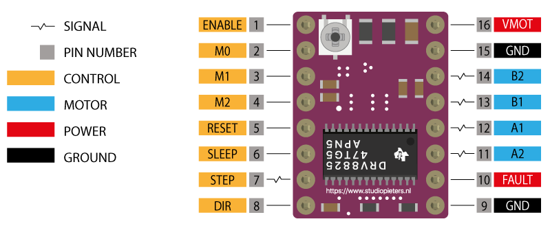

# Vårat elektronikprojekt!

Här kan vi skriva dokumentation om hur produkten används.

## Komponenter

* 1 Arduino mega
* 1 [ESP32-S3](https://www.electrokit.com/utvecklingskort-esp32-s3)
* 3 [Motordrivare](https://www.electrokit.com/stegmotordrivare-drv8825)
* 1 [RFID-läsare](https://www.electrokit.com/rfid-modul-med-tva-tags-13.56mhz)
* 1 [Nivåomvandlare](https://www.electrokit.com/nivaomvandlare-4-kanaler-bidirektionell)
* 1 Spännningsaggregat

## Hur man sätter upp komponenterna

### Motordrivarna, arduinon & spänningsaggregatet

1. Koppla samman pin 6 och 7 på alla motordrivare.

2. Koppla samman pin 9 och 15 på alla motordrivare.

3. Koppla samman följande pins mellan motordrivarna.
    * 1
    * 2
    * 3
    * 4
    * 5
    * 8
    * 9
    * 16

4. Välj ut en av motordrivarna och koppla enligt följande.
    * Pin 1 ->

