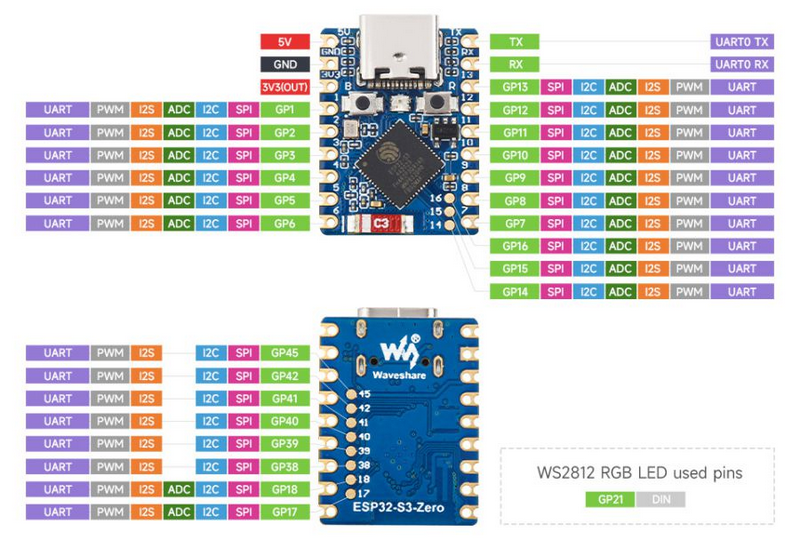

# Vårat elektronikprojekt!

Här kan vi skriva dokumentation om hur produkten används.

## Komponenter

* 1 Arduino mega
* 1 [ESP32-S3](https://www.electrokit.com/utvecklingskort-esp32-s3)
* 3 [Motordrivare](https://www.electrokit.com/stegmotordrivare-drv8825)
* 1 [RFID-läsare](https://www.electrokit.com/rfid-modul-med-tva-tags-13.56mhz)
* 1 [Nivåomvandlare](https://www.electrokit.com/nivaomvandlare-4-kanaler-bidirektionell)
* 2 [Avståndssensorer](https://www.electrokit.com/en/avstandsmatare-ultraljud-hc-sr04-2-400cm)
* 1 Spännningsaggregat
* 1 100 $\mu$F kondensator
* 1 Mikrobrytare

## Hur man sätter upp komponenterna

### Motordrivarna, arduinon, spänningsaggregatet & kondensatorn

<!--  -->

1. Koppla samman pin 6 och 7 på alla motordrivare.

2. Koppla samman pin 9 och 15 på alla motordrivare.

3. Koppla samman följande pins mellan motordrivarna.
    * 1
    * 2
    * 3
    * 4
    * 5
    * 8
    * 9
    * 16

4. sätt en kondensator mellan 15 V och Jord på spänningsaggrigatet.

5. Välj ut en av motordrivarna och koppla enligt följande mellan motordrivaren, arduinon och spänningsaggregatet.
    * Jord på spänningsaggregatet &harr; **GND**
    * Pin 1 &harr; **D26**
    * Pin 2 &harr; **D27**
    * Pin 3 &harr; **D28**
    * Pin 4 &harr; **D29**
    * Pin 5 &harr; **5V**
    * Pin 8 &harr; **D25**
    * Pin 9 &harr; **GND**
    * Pin 16 &harr; 15 Volt på spänningsaggregatet

6. Koppla motordrivarna till motorerna enligt följande.
    * Pin 14 &harr; **Blå**
    * Pin 13 &harr; **Röd**
    * Pin 12 &harr; **Grön**
    * Pin 11 &harr; **Svart**

7. Välj ut vilken uppgift varje motordrivare har och koppla Pin 7 enligt följande.
    * Fyller skål 1 &harr; **D22**
    * Fyller skål 2 &harr; **D23**
    * Vrider skålarna &harr; **D24**

### ESP32, nivåomvandlaren & arduinon

 

#### Mellan Esp32 och nivåomvandlaren

* **D9** &harr; **LV2** (SDA channel)
* **D8** &harr; **LV4** (SCL channel)
* **GND** &harr; **GND** 

#### Mellan arduinon och nivåomvandlaren

* **5V** &harr; **HV**
* **3.3V** &harr; **LV**
* **GND** &harr; **GND**
* **D20** &harr; **HV2** (SDA channel)
* **D21** &harr; **HV4** (SCL channel)

### RFID-läsaren och arduinon

Koppla från RFID-läsaren till arduinon enligt följande. 
* **RST** &harr; **D5**
* **SPI SS** &harr; **D53**
* **SPI MOSI** &harr; **D51**
* **SPI MISO** &harr; **D50**
* **SPI SCK** &harr; **D52**
* **VCC** &harr; **3.3V**
* **GND** &harr; **GND**

### Avståndssencorerna och arduinon

Koppla enligt följande för båda sensorerna.
* **VCC** &harr; **5V**
* **GND** &harr; **GND**

Välj sedan ut vilken mätare som ska mäta på skål 1 och koppla,
* **TRIG** &harr; **D44**
* **ECHO** &harr; **D45**

Koppla följande med den andra sensorn.
* **TRIG** &harr; **D46**
* **ECHO** &harr; **D47**

### Mikrobrytare och Arduinon

Koppla enligt följande mellan komponenterna.
* **GND** &harr; **NC (2)**
* **D8** &harr; **NO (3)**
* **D9** &harr; **COM (1)**

## Uppladdning

För att allt ska fungera måste du göra ändringar i filen **jsonInfo.hpp**. I variabeln wifiJson, skriv in ssid och lösenordet till ditt nätverk. 

Därefter, ladda upp **master.ino** på arduinon och **slave.ino** på esp32. Nu ska allting fungera.
